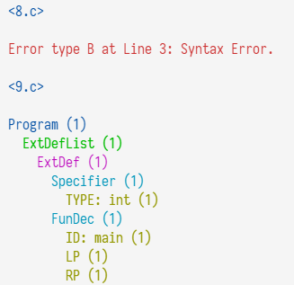

# 实验一报告

## 实现了那些功能？

### C--语言词法分析器（Flex）

基于flex工具实现的C--语言词法分析器代码位于`lexical.l`。

分析器共包含两种状态`INITIAL`和`COMMENT`;后者用于处理多行注释。除去关键字、界符和操作符等外，我设置了以下正则表达式来匹配整数、浮点数和标识符：

```lex
binary 0[bB][01]+
octal (0[0-7]+)
decimal ([1-9][0-9]*|0)
hex 0[xX][0-9a-fA-F]+
realnum ([0-9]*\.[0-9]+|[0-9]+\.)([eE][\+\-]?[0-9]+)?
id [_a-zA-Z][_0-9a-zA-Z]{0,31}
```

### 语法树

使用C语言写的一颗语法树，位于`syntxa.y`头部。

```c
union NodeValue
{
    int intv;
    double fltv;
    char* strv; 
};

union NodeValue EmptyNodeValue;

struct Node
{
    char* type;
    union NodeValue value;
    int children_count;
    struct Node** children;
    int line_num;
};

struct Node empty_node_origin={
	type:"EMPTY",
	value:{intv:0},
	children_count:0,
	children:NULL,
	line_num:-1
};

struct Node* root=NULL;
struct Node* new_node(char* type,int ln, int children_count,struct Node* children[]);
struct Node* new_vnode(char* type, int ln,union NodeValue value);
struct Node* new_fnode(char* type, int ln);
struct Node* empty_node=&empty_node_origin;
struct Node* create_node(char* type,union NodeValue value, int children_count,struct Node* children[],int ln);
union NodeValue uv_int(int value);
union NodeValue uv_flt(float value);
union NodeValue uv_str(char* value);
```

提供以下方便的操作：

- `create_node()`使用完整的信息，在堆内分配内存并创建一个节点
- `new_node()`创建一个指定类型和行号的无值节点(主要用来创建非终结符节点)
- `new_vnode()`创建一个指定类型和行号的有值叶节点(用来创建常量、标识符节点)
- `new_fnode()`创建一个指定类型和行号的无值叶节点(用来创建界符、关键字、操作符节点)
- `empty_node`指定的空节点，用于匹配空串的情况
- `root`根节点，用于匹配`Program`
- `uv_int`获取整数常量的节点值
- `uv_flt`获取浮点常量的节点值
- `uv_str`获取标识符名称的节点值

### C--语言语法分析器（Bison）

基于bison工具实现的C--语言语法分析器代码位于`syntax.y`。语法和词法完全按实验手册附录完成，部分语法成分的名称有改动(如`SEMI->SEM;PLUS->ADD`)。与附录中不同的是，当终结符$SUB$为$Exp\rarr SUB\space Exp$的成分时，该节点的被视为`NEG`(表示负号)而非`SUB`(表示减号)。

由于采用上一小节中语法树的封装，整体代码非常简单易读，易于维护。

## 程序应该如何被编译？

程序使用makefile进行编译。makefile提供以下目标：

- all(默认): clean，然后编译生成可执行文件parser
- parser: 编译生成可执行文件parser
- head: clean，然后生成`syntax.tab.h`
- test：编译并运行所有位于`examples-lab1`中的测试案例
- testreq：编译并运行位于`examples-lab1`中的测试案例1-5
- testopt：编译并运行位于`examples-lab1`中的测试案例6-10
- clean: 清理
- debug: clean，然后编译并运行所有位于`examples-lab1`中的测试案例

## 特性

### 词法分析器单独调试-LEXDEBUG功能

独立的主文件`main.c`中提供`LEXDEBUG`宏可以开关单独的词法分析器调试。

### 语法树&异常显示高亮功能

异常文字会显示为红色；语法树中的文字会根据层级不同，显示为其它不同的颜色。
  
